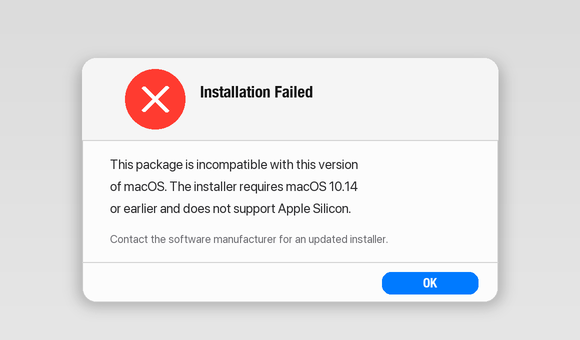
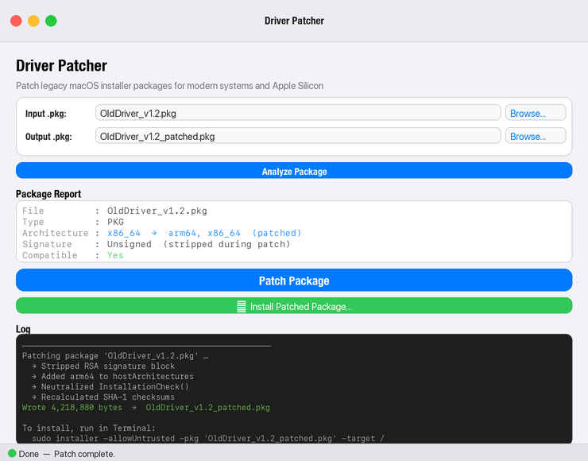

# Driver Patcher

If you've tried to install an older driver or peripheral software on a modern Mac and seen this:

> *"This package is incompatible with this version of macOS."*
> *"This package requires macOS 10.14 or earlier."*
> *"This software cannot be installed on this computer."*

— Driver Patcher fixes it. It's a macOS GUI tool that patches legacy `.pkg` and `.dmg` installer packages to run on modern macOS and Apple Silicon (arm64).

> **Disclaimer:** Driver Patcher is an independent, community-made tool. It is **not affiliated with, endorsed by, or supported by Apple Inc.** Patching modifies and strips code signatures from installer packages. Use entirely at your own risk. Always keep a backup of the original file.

---

## Before / After

<!-- Replace the placeholders below with your own screenshots or a screen recording GIF -->

| Before | After |
|--------|-------|
|  |  |

> *To add your own screenshots: create a `docs/` folder in the repo, drop in `before.png` and `after.png`, and the table above will render automatically.*

---

## What it does

- Strips RSA and CMS code signatures from flat `.pkg` archives
- Adds `arm64` to the `hostArchitectures` attribute so installers run natively on Apple Silicon
- Neutralizes `InstallationCheck` scripts and OS version gates that block installation on modern macOS
- Supports both flat `.pkg` files and `.dmg` disk images containing packages
- Recalculates all xar checksums and heap offsets so the patched archive remains structurally valid

---

## Security & how signing is handled

Older installer packages often carry a developer signature that macOS uses to verify the file hasn't been tampered with. Driver Patcher intentionally removes that signature as part of patching — here's what that means in practice:

**What Driver Patcher does:**
- Reads the original `.pkg` or `.dmg` as a read-only input — the source file is never modified
- Strips the RSA/CMS code-signing blocks from the xar archive
- Recalculates all internal checksums (SHA-1) so the archive is structurally valid and `xar` can still open it
- For DMGs, mounts the source image read-only and works entirely in a temporary directory; the original DMG is never touched

**What this means for Gatekeeper:**
- The patched package is **unsigned**. macOS Gatekeeper will flag it on first install.
- To allow it: right-click → Open in Finder, or go to **System Settings → Privacy & Security** and click *Open Anyway* after the blocked attempt.
- The `installer` command used under the hood runs with `-allowUntrusted`, which explicitly permits unsigned packages.

**What Driver Patcher does *not* do:**
- It does not modify any files outside the output path you choose
- It does not make network requests
- It does not require root during patching — only the optional one-click install step requests administrator privileges (via a standard macOS password prompt)

---

## Requirements

- macOS (uses system tools `hdiutil` and `osascript`)
- Python 3.10 or later
- PySide6

## Installation

```bash
# Recommended: use a virtual environment
python3 -m venv .venv
source .venv/bin/activate
pip install -r requirements.txt
```

## Running

**Double-click** `Driver Patcher.command` in Finder — it will check for PySide6 and offer to install it if missing.

Or launch directly from the terminal:

```bash
python3 main.py
```

## Usage

1. Click **Browse…** and select a `.pkg` or `.dmg` file
2. Click **Analyze Package** to inspect the package metadata
3. Review the report — warnings flag version locks and architecture restrictions
4. Confirm the output path and click **Patch Package**
5. Optionally click **Install Patched Package** to install immediately (requires administrator password)

## Notes

- The `Driver Patcher.command` launcher installs PySide6 globally if you choose to. Using a virtual environment (see above) keeps your system Python clean.
- DMG patching mounts the source image read-only, patches all embedded packages in a temporary directory, then builds a new compressed DMG with `hdiutil`.

## License

MIT — see [LICENSE](LICENSE).
